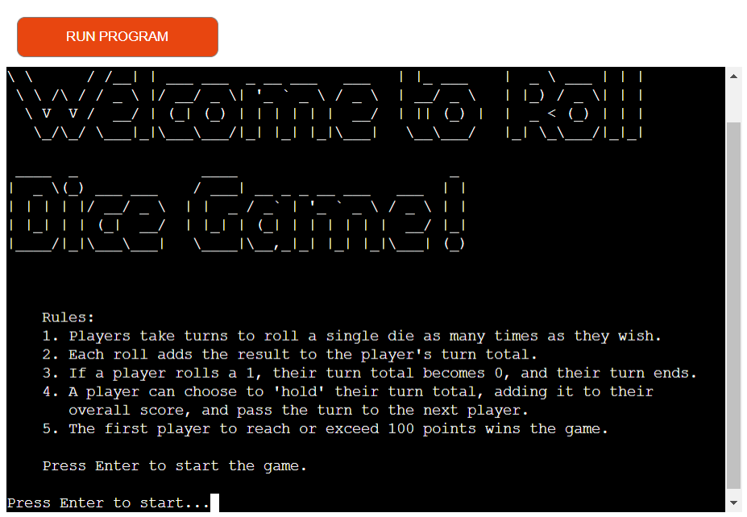
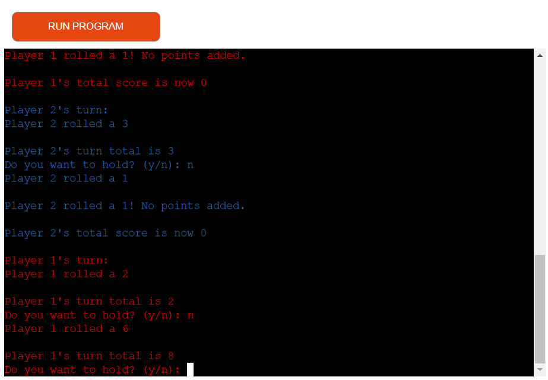
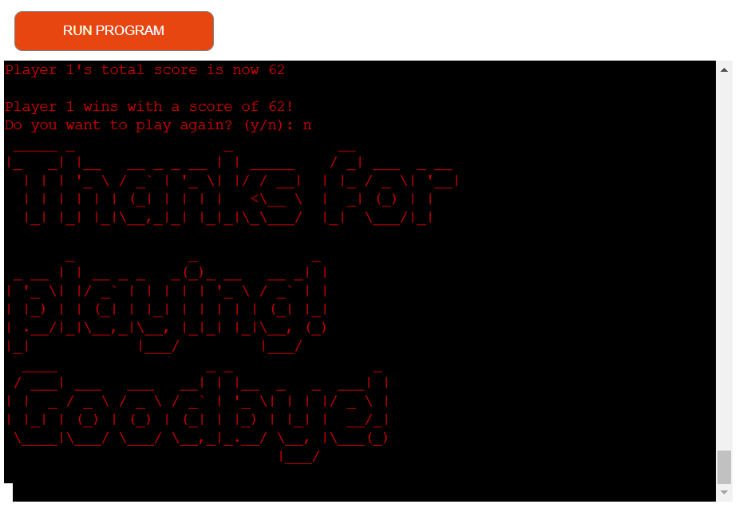
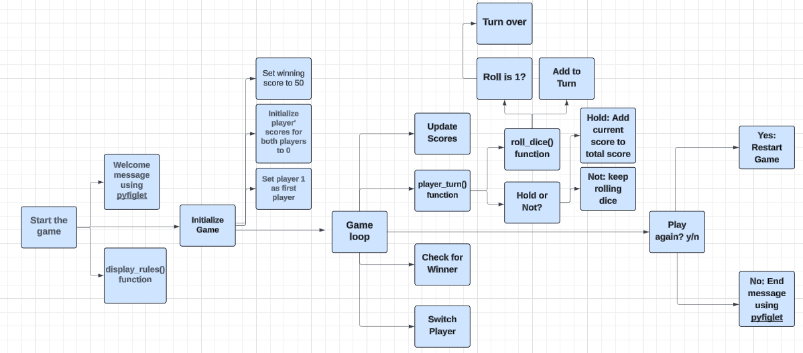
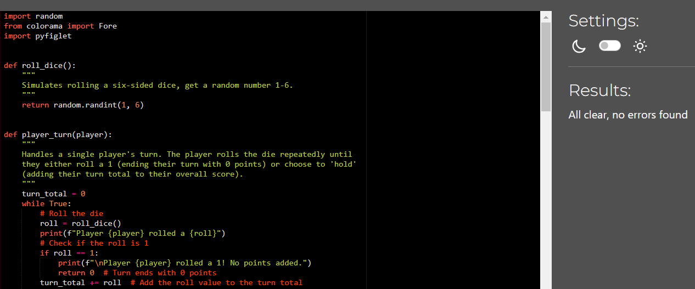
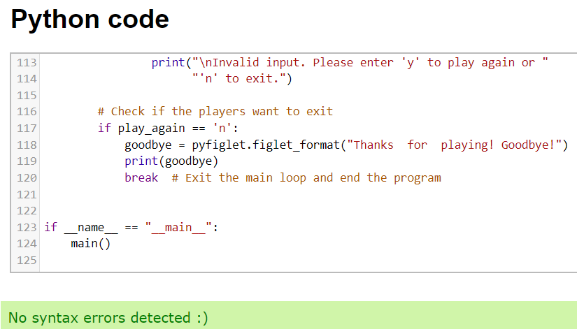

# Roll Dice Game

Welcome to the Roll Dice Game! This is a simple implementation of the classic dice game "Pig" using Python. View the live site [here](https://roll-dice09-55f0f87de3ed.herokuapp.com/)

## Game Rules

- Players take turns to roll a single die as many times as they wish
- Each roll adds the result to the player's turn total
- If a player rolls a 1, their turn total becomes 0, and their turn ends
- A player can choose to 'hold' their turn total, adding it to their overall score, and pass the turn to the next player
- The first player to reach or exceed 100 points wins the game

## How to Play

- Run the script to start the game
- The game will display the rules. Press Enter to start
- Players take turns rolling the die. After each roll, they can choose to roll again or hold their score
- The game continues until one player reaches or exceeds 100 points
- After the game ends, players can choose to play again or exit

## Features

- Welcome message and rules display

- Playing the game

- Game over
  - User have a option to play a game again or quit the game

## Technologies

- Gitpod
  - The website was developed using Gitpod
  - Gitpod was used to commit and push code to GitHub
- GitHub
  - Source code is hosted on GitHub
- Heroku
  - Webpage is deployed using from Heroku
- colorama
  - colorama is used to make player 1 turn red and player 2 turn blue
- pyfiglet
  - pyfiglet is used to convert welcome and goodbye message text into ASCII art fonts
- Lucidchart
  - Lucidchart is used to make flowchart

## Lucidchart

- Lucidchart is used as basic idea about steps needed to make the Roll Dice Game

## Testing

- Game is tested using:
  - https://pep8ci.herokuapp.com/

  - https://www.online-ide.com/online_python_syntax_checker

