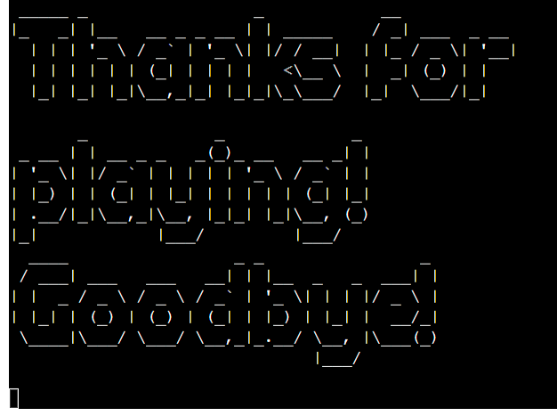
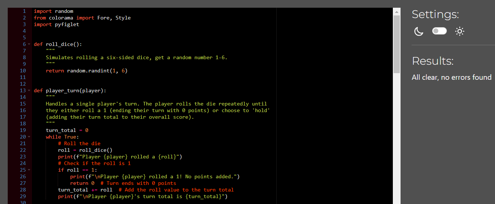
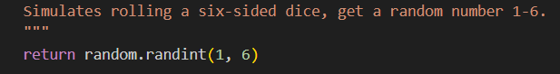
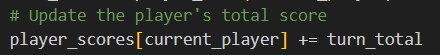
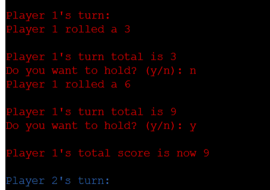
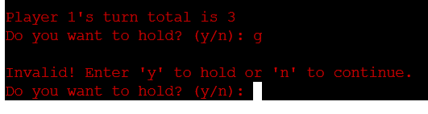
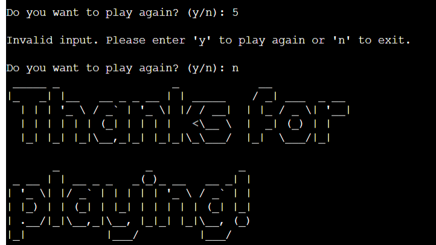
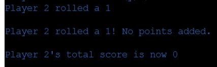
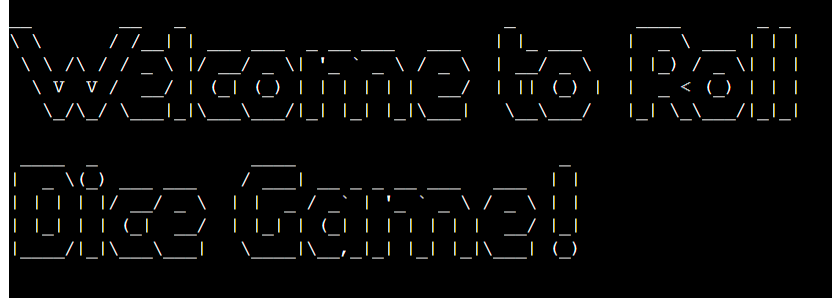

# Roll Dice Game

Welcome to the Roll Dice Game! This is a simple implementation of the classic dice game "Pig" using Python. View the live site [here](https://roll-dice09-55f0f87de3ed.herokuapp.com/)

## Game Rules

- Players take turns to roll a single die as many times as they wish
- Each roll adds the result to the player's turn total
- If a player rolls a 1, their turn total becomes 0, and their turn ends
- A player can choose to 'hold' their turn total, adding it to their overall score, and pass the turn to the next player
- The first player to reach or exceed 50 points wins the game

## How to Play

- Run the script to start the game
- The game will display the rules. Press Enter to start
- Players take turns rolling the die. After each roll, they can choose to roll again or hold their score
- The game continues until one player reaches or exceeds 50 points
- After the game ends, players can choose to play again or exit

## Features

- Welcome message and rules display

- Playing the game

- Game over
  - User have a option to play a game again or quit the game

## Technologies

- Gitpod
  - The website was developed using Gitpod
  - Gitpod was used to commit and push code to GitHub
- GitHub
  - Source code is hosted on GitHub
- Heroku
  - Webpage is deployed using from Heroku
- colorama
  - colorama is used to make player 1 turn red and player 2 turn blue
- pyfiglet
  - pyfiglet is used to convert welcome and goodbye message text into ASCII art fonts
- Lucidchart
  - Lucidchart is used to make flowchart

## Lucidchart

- Lucidchart is used as basic idea about steps needed to make the Roll Dice Game

## Testing

- Game is tested using:
  - https://pep8ci.herokuapp.com/

  - https://www.online-ide.com/online_python_syntax_checker

## Functional Testing
All features works as they should:

- Enter on welcome page:
  - when user press Enter, Game starts

- mathematics
  - mathematics are working as it should

  
- y/n for hold:
  - yes: player choose to 'hold' their turn total, adding it to their overall score, and pass the turn to the next player
  - no: player chose to continue rolling dice, adding each number to their turn total

- if user enters anything but y/n:
  - if user enters anything but y/n, message will be printed to warn them

- if player roll 1:
  - if a player rolls a 1, their turn total becomes 0, and their turn ends

- play again when game is over:
  - yes: Game starts again
  - no: Game over! Goodbye message will be displayed

- color set/reset, pyfiglet:
  - welcome message is written in pyfiglet
  - player 1 turn is red colored
  - player 2 turn is blue colored
  - game over is reset to white again and written in pyfiglet

## Deployment

- The site was deployed via Heroku, and the live link can be found [here](https://roll-dice09-55f0f87de3ed.herokuapp.com/) 
- Before deploying to Heroku pip3 freeze > requirements.txt was used to add all the dependencies required to the requirements.txt file. This is required for the game to run on Heroku.
- The following steps were then taken:
    - log in to [Heroku](https://id.heroku.com/login)
    - on the main page from the drop-down menu select "Create New App"
    - enter a unique app name
    - select your region
    - click on the Create App button
    - click on the Settings Tab and scroll down to Config Vars
    - click Reveal Config Vars and enter PORT into the Key box and 8000 into the Value box and click the Add button
    - scroll down to the Buildpack section, clock Add Buildpack select Python and click Save Changes
    - scroll down to the Buildpack section, clock Add Buildpack select node.js and click Save Changes
    - scroll to the top of the page and choose the Deploy tab
    - select Github as the deployment method
    - confirm you want to connect to GitHub
    - search for the repository name and click the connect button
    - scroll to the bottom of the deploy page and click Deploy Branch to deploy manually
    - click View to view the deployed site

## Deployment Bug
- during deployment no bugs were found

## Credits
- Roll Dice Game was made using next resources:
    - https://www.w3schools.com/
    - https://overapi.com/python
    - https://www.youtube.com/watch?v=NpmFbWO6HPU&t=6384s
    - https://www.reddit.com/r/learnpython/comments/dbs67z/pig_dice_game_python/?rdt=35926
    - https://www.codewizardshq.com/python-tutorial-for-kids-pig-dice-game/
